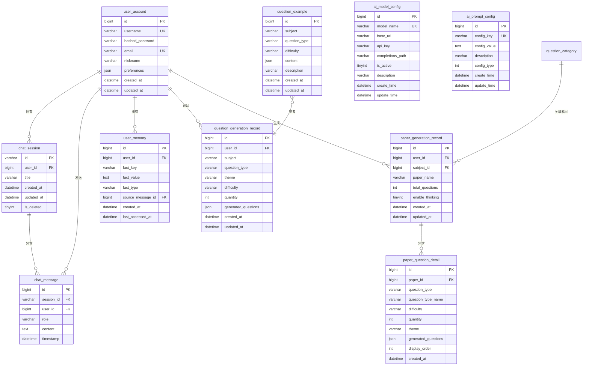

# Novi 数据库设计文档

## 📋 数据库概述

**数据库名称**：`novi`  
**字符集**：`utf8mb4`  
**排序规则**：`utf8mb4_unicode_ci`  
**数据库引擎**：InnoDB

## 📊 ER 关系图

## 🗄️ 数据表详细设计

### 1. user_account（用户账号表）

**用途**：存储用户账号信息和认证凭据

| 字段名 | 数据类型 | 约束 | 说明 |
|--------|---------|------|------|
| id | BIGINT | PK, AUTO_INCREMENT | 用户ID |
| username | VARCHAR(50) | UNIQUE, NOT NULL | 用户名 |
| hashed_password | VARCHAR(255) | NOT NULL | 加密后的密码 |
| nickname | VARCHAR(50) | | 昵称 |
| email | VARCHAR(100) | UNIQUE | 邮箱 |
| preferences | JSON | | 用户偏好设置 |
| created_at | TIMESTAMP | DEFAULT NOW() | 注册时间 |
| updated_at | TIMESTAMP | ON UPDATE NOW() | 更新时间 |

**索引**：
- PRIMARY KEY (`id`)
- UNIQUE KEY (`username`)
- UNIQUE KEY (`email`)

**SQL脚本**：`user_account.sql`

---

### 2. chat_session（聊天会话表）

**用途**：存储聊天会话元数据

| 字段名 | 数据类型 | 约束 | 说明 |
|--------|---------|------|------|
| id | VARCHAR(100) | PK | 会话ID (UUID) |
| user_id | BIGINT | NOT NULL, FK | 用户ID |
| title | VARCHAR(255) | | 会话标题 |
| created_at | TIMESTAMP | DEFAULT NOW() | 创建时间 |
| updated_at | TIMESTAMP | ON UPDATE NOW() | 最后活跃时间 |
| is_deleted | TINYINT(1) | DEFAULT 0 | 是否删除 |

**索引**：
- PRIMARY KEY (`id`)
- KEY `idx_user_updated` (`user_id`, `updated_at`)

**SQL脚本**：`chat_session.sql`

---

### 3. chat_message（聊天消息表）

**用途**：存储聊天消息内容（实现上下文记忆）

| 字段名 | 数据类型 | 约束 | 说明 |
|--------|---------|------|------|
| id | BIGINT | PK, AUTO_INCREMENT | 消息ID |
| user_id | BIGINT | NOT NULL, FK | 用户ID |
| session_id | VARCHAR(100) | NOT NULL, FK | 会话ID |
| role | VARCHAR(20) | NOT NULL | 角色：user/assistant |
| content | TEXT | NOT NULL | 消息内容 |
| timestamp | TIMESTAMP | DEFAULT NOW() | 消息时间戳 |

**索引**：
- PRIMARY KEY (`id`)
- KEY `idx_user_session` (`user_id`, `session_id`, `timestamp`)

**SQL脚本**：`chat_message.sql`

---

### 4. user_memory（用户记忆表）

**用途**：存储AI提取的用户画像和事实记忆

| 字段名 | 数据类型 | 约束 | 说明 |
|--------|---------|------|------|
| id | BIGINT | PK, AUTO_INCREMENT | 记忆ID |
| user_id | BIGINT | NOT NULL, FK | 用户ID |
| fact_key | VARCHAR(100) | NOT NULL | 事实键 |
| fact_value | TEXT | NOT NULL | 事实值 |
| fact_type | VARCHAR(50) | | 记忆类型 |
| source_message_id | BIGINT | FK | 来源消息ID |
| created_at | TIMESTAMP | DEFAULT NOW() | 创建时间 |
| last_accessed_at | TIMESTAMP | | 最后访问时间 |

**索引**：
- PRIMARY KEY (`id`)
- UNIQUE KEY `uk_user_fact` (`user_id`, `fact_key`)

**SQL脚本**：`user_memory.sql`

---

### 5. ai_model_config（AI模型配置表）

**用途**：存储AI模型配置，支持热切换

| 字段名 | 数据类型 | 约束 | 说明 |
|--------|---------|------|------|
| id | BIGINT | PK, AUTO_INCREMENT | 主键ID |
| model_name | VARCHAR(100) | UNIQUE, NOT NULL | 模型名称 |
| base_url | VARCHAR(255) | NOT NULL | API基础URL |
| api_key | VARCHAR(255) | NOT NULL | API密钥 |
| completions_path | VARCHAR(100) | DEFAULT '/chat/completions' | 完成接口路径 |
| is_active | TINYINT(1) | DEFAULT 0 | 是否激活 |
| enable_thinking | TINYINT(1) | DEFAULT 0 | 是否启用深度思考 |
| description | VARCHAR(255) | | 模型描述 |
| create_time | DATETIME | DEFAULT NOW() | 创建时间 |
| update_time | DATETIME | ON UPDATE NOW() | 更新时间 |

**索引**：
- PRIMARY KEY (`id`)
- UNIQUE KEY `uk_model_name` (`model_name`)

**SQL脚本**：`ai_model_config.sql`

---

### 6. ai_prompt_config（AI提示词配置表）

**用途**：存储系统提示词、性格、语气风格配置

| 字段名 | 数据类型 | 约束 | 说明 |
|--------|---------|------|------|
| id | BIGINT | PK, AUTO_INCREMENT | 主键ID |
| config_key | VARCHAR(100) | UNIQUE, NOT NULL | 配置键 |
| config_value | TEXT | NOT NULL | 配置值 |
| description | VARCHAR(255) | | 描述 |
| config_type | INT | DEFAULT 0 | 类型：0系统/1性格/2语气 |
| create_time | DATETIME | DEFAULT NOW() | 创建时间 |
| update_time | DATETIME | ON UPDATE NOW() | 更新时间 |

**索引**：
- PRIMARY KEY (`id`)
- UNIQUE KEY `uk_config_key` (`config_key`)

**SQL脚本**：`ai_prompt_config.sql`

---

### 7. question_example（题目示例表）

**用途**：存储各科目、各题型的示例题目，用于AI few-shot学习

| 字段名 | 数据类型 | 约束 | 说明 |
|--------|---------|------|------|
| id | BIGINT | PK, AUTO_INCREMENT | 主键ID |
| subject | VARCHAR(50) | NOT NULL | 科目 |
| question_type | VARCHAR(50) | NOT NULL | 题型 |
| difficulty | VARCHAR(20) | NOT NULL | 难度 |
| content | JSON | NOT NULL | 题目JSON |
| description | VARCHAR(255) | | 描述 |
| created_at | TIMESTAMP | DEFAULT NOW() | 创建时间 |
| updated_at | TIMESTAMP | ON UPDATE NOW() | 更新时间 |

**索引**：
- PRIMARY KEY (`id`)
- KEY `idx_subject_type_difficulty` (`subject`, `question_type`, `difficulty`)

**SQL脚本**：`question_example.sql`

---

### 8. question_generation_record（题目生成记录表）

**用途**：存储用户题目生成历史记录

| 字段名 | 数据类型 | 约束 | 说明 |
|--------|---------|------|------|
| id | BIGINT | PK, AUTO_INCREMENT | 主键ID |
| user_id | BIGINT | NOT NULL, FK | 用户ID |
| subject | VARCHAR(50) | NOT NULL | 科目 |
| question_type | VARCHAR(50) | NOT NULL | 题型 |
| theme | VARCHAR(100) | | 主题 |
| difficulty | VARCHAR(20) | NOT NULL | 难度 |
| quantity | INT | NOT NULL | 数量 |
| generated_questions | JSON | NOT NULL | 生成的题目JSON |
| created_at | TIMESTAMP | DEFAULT NOW() | 创建时间 |
| updated_at | TIMESTAMP | ON UPDATE NOW() | 更新时间 |

**索引**：
- PRIMARY KEY (`id`)
- KEY `idx_user_created` (`user_id`, `created_at` DESC)

**SQL脚本**：`question_generation_record.sql`

---

### 9. question_category（题目分类表）

**用途**：存储题目分类信息（科目、题型等）

| 字段名 | 数据类型 | 约束 | 说明 |
|--------|---------|------|------|
| id | BIGINT | PK, AUTO_INCREMENT | 主键ID |
| name | VARCHAR(50) | NOT NULL | 分类名称 |
| code | VARCHAR(50) | UNIQUE, NOT NULL | 分类编码 |
| parent_id | BIGINT | DEFAULT 0 | 父级ID |
| category_type | INT | NOT NULL | 类型 1:科目 2:题型 3:套卷 |
| sort_order | INT | DEFAULT 0 | 排序 |
| create_time | DATETIME | DEFAULT NOW() | 创建时间 |
| update_time | DATETIME | ON UPDATE NOW() | 更新时间 |

**索引**：
- PRIMARY KEY (`id`)
- UNIQUE KEY `uk_code` (`code`)
- KEY `idx_parent_id` (`parent_id`)

**SQL脚本**：`question_category.sql`

---

### 10. paper_generation_record（套卷生成记录表）

**用途**：存储用户生成的整套试卷记录

| 字段名 | 数据类型 | 约束 | 说明 |
|--------|---------|------|------|
| id | BIGINT | PK, AUTO_INCREMENT | 主键ID |
| user_id | BIGINT | NOT NULL, FK | 用户ID |
| subject_id | BIGINT | NOT NULL, FK | 科目ID |
| paper_name | VARCHAR(100) | NOT NULL | 套卷名称 |
| total_questions | INT | NOT NULL | 总题目数量 |
| enable_thinking | TINYINT(1) | DEFAULT 0 | 是否启用深度思考 |
| created_at | TIMESTAMP | DEFAULT CURRENT_TIMESTAMP | 创建时间 |
| updated_at | TIMESTAMP | ON UPDATE | 更新时间 |

**索引**：
- PRIMARY KEY (`id`)
- KEY `idx_user_created` (`user_id`, `created_at` DESC)

**SQL脚本**：`paper_generation_record.sql`

---

### 11. paper_question_detail（套卷题目明细表）

**用途**：存储每个套卷中各个题型的具体题目内容

| 字段名 | 数据类型 | 约束 | 说明 |
|--------|---------|------|------|
| id | BIGINT | PK, AUTO_INCREMENT | 主键ID |
| paper_id | BIGINT | NOT NULL, FK | 套卷ID |
| question_type | VARCHAR(50) | NOT NULL | 题型编码 |
| question_type_name | VARCHAR(50) | NOT NULL | 题型名称 |
| difficulty | VARCHAR(20) | NOT NULL | 难度 |
| quantity | INT | NOT NULL | 题目数量 |
| theme | VARCHAR(100) | | 主题 |
| generated_questions | JSON | NOT NULL | 生成的题目JSON |
| display_order | INT | NOT NULL | 显示顺序 |
| created_at | TIMESTAMP | DEFAULT CURRENT_TIMESTAMP | 创建时间 |

**索引**：
- PRIMARY KEY (`id`)
- INDEX `idx_paper_order` (`paper_id`, `display_order`)

**SQL脚本**：`paper_question_detail.sql`

---

## 🔗 表关系说明

### 一对多关系

1. **user_account → chat_session**  
   一个用户可以有多个会话

2. **user_account → chat_message**  
   一个用户可以发送多条消息

3. **chat_session → chat_message**  
   一个会话包含多条消息

4. **user_account → user_memory**  
   一个用户可以有多条记忆

5. **user_account → question_generation_record**  
   一个用户可以有多条出题记录

6. **question_category (Self) → question_category**
   分类表自关联（父子级关系）

7. **user_account → paper_generation_record**
   一个用户可以生成多套试卷

8. **paper_generation_record → paper_question_detail**
   一套试卷包含多个题型明细

9. **question_category → paper_generation_record**
   套卷通过 subject_id 关联科目分类

## 📝 初始化脚本执行顺序

1. `user_account.sql` - 用户表（基础表）
2. `chat_session.sql` - 会话表
3. `chat_message.sql` - 消息表
4. `user_memory.sql` - 记忆表
5. `ai_model_config.sql` - 模型配置表
6. `ai_prompt_config.sql` - 提示词配置表
7. `question_category.sql` - 题目分类表
8. `question_example.sql` - 题目示例表
9. `question_generation_record.sql` - 出题记录表
10. `paper_generation_record.sql` - 套卷记录表
11. `paper_question_detail.sql` - 套卷明细表

## 🔧 数据库优化建议

### 索引优化

- 为高频查询字段添加索引
- 组合索引按查询顺序排列
- 定期分析慢查询日志

### 性能优化

- 使用连接池（HikariCP）
- 启用查询缓存
- 定期清理历史数据

### 备份策略

- 每日全量备份
- 实时binlog备份
- 定期测试恢复流程

## 📚 相关文档

- [项目概览](file:///C:/Users/35666/.gemini/antigravity/brain/774ebe23-99e1-46d9-a3e1-52263e77b58e/项目概览.md)
- SQL脚本位置：`src/main/resources/static/`
