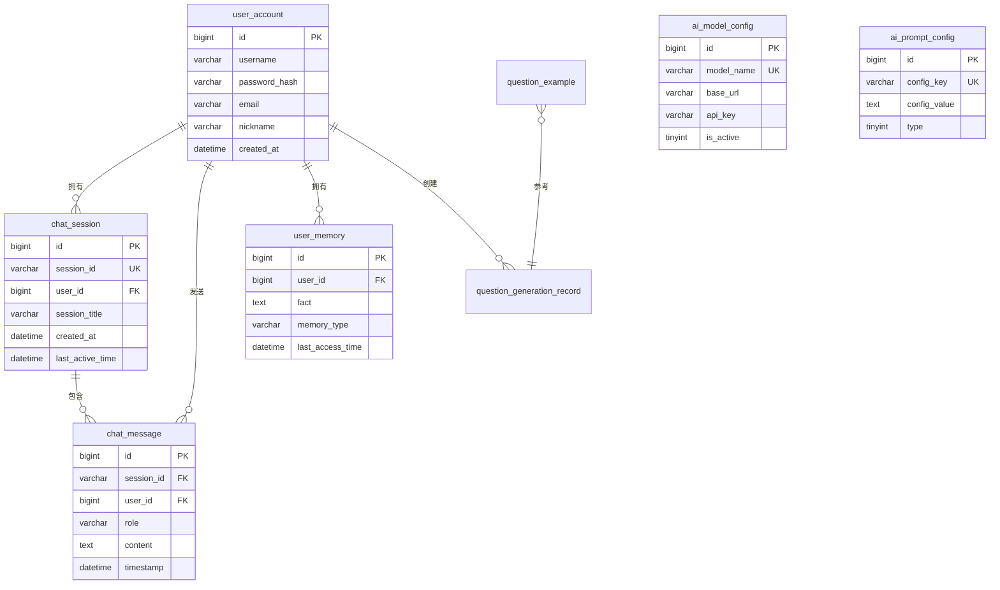

# Novi 数据库设计文档

## 📋 数据库概述

**数据库名称**：`novi`  
**字符集**：`utf8mb4`  
**排序规则**：`utf8mb4_unicode_ci`  
**数据库引擎**：InnoDB

## 📊 ER 关系图

## 🗄️ 数据表详细设计

### 1. user_account（用户账号表）

**用途**：存储用户账号信息和认证凭据

| 字段名 | 数据类型 | 约束 | 说明 |
|--------|---------|------|------|
| id | BIGINT | PK, AUTO_INCREMENT | 用户ID |
| username | VARCHAR(50) | UNIQUE, NOT NULL | 用户名 |
| password_hash | VARCHAR(255) | NOT NULL | 密码BCrypt哈希 |
| email | VARCHAR(100) | UNIQUE | 邮箱 |
| nickname | VARCHAR(50) | | 昵称 |
| created_at | DATETIME | DEFAULT NOW() | 注册时间 |
| updated_at | DATETIME | ON UPDATE NOW() | 更新时间 |

**索引**：
- PRIMARY KEY (`id`)
- UNIQUE KEY (`username`)
- UNIQUE KEY (`email`)

**SQL脚本**：`user_account.sql`

---

### 2. chat_session（聊天会话表）

**用途**：存储聊天会话元数据

| 字段名 | 数据类型 | 约束 | 说明 |
|--------|---------|------|------|
| id | BIGINT | PK, AUTO_INCREMENT | 主键ID |
| session_id | VARCHAR(100) | UNIQUE, NOT NULL | 会话UUID |
| user_id | BIGINT | NOT NULL, FK | 用户ID |
| session_title | VARCHAR(200) | | 会话标题 |
| created_at | DATETIME | DEFAULT NOW() | 创建时间 |
| last_active_time | DATETIME | | 最后活跃时间 |
| is_deleted | TINYINT(1) | DEFAULT 0 | 是否删除 |

**索引**：
- PRIMARY KEY (`id`)
- UNIQUE KEY (`session_id`)
- KEY `idx_user_active` (`user_id`, `last_active_time` DESC)

**SQL脚本**：`chat_session.sql`

---

### 3. chat_message（聊天消息表）

**用途**：存储聊天消息内容（实现上下文记忆）

| 字段名 | 数据类型 | 约束 | 说明 |
|--------|---------|------|------|
| id | BIGINT | PK, AUTO_INCREMENT | 消息ID |
| session_id | VARCHAR(100) | NOT NULL | 会话ID |
| user_id | BIGINT | NOT NULL | 用户ID |
| role | VARCHAR(20) | NOT NULL | 角色：user/assistant |
| content | TEXT | NOT NULL | 消息内容 |
| timestamp | DATETIME | DEFAULT NOW() | 时间戳 |

**索引**：
- PRIMARY KEY (`id`)
- KEY `idx_session_time` (`session_id`, `timestamp`)
- KEY `idx_user_id` (`user_id`)

**SQL脚本**：`chat_message.sql`

---

### 4. user_memory（用户记忆表）

**用途**：存储AI提取的用户画像和事实记忆（计划中功能）

| 字段名 | 数据类型 | 约束 | 说明 |
|--------|---------|------|------|
| id | BIGINT | PK, AUTO_INCREMENT | 记忆ID |
| user_id | BIGINT | NOT NULL, FK | 用户ID |
| fact | TEXT | NOT NULL | 事实描述 |
| memory_type | VARCHAR(50) | | 记忆类型 |
| last_access_time | DATETIME | | 最后访问时间 |
| created_at | DATETIME | DEFAULT NOW() | 创建时间 |

**索引**：
- PRIMARY KEY (`id`)
- KEY `idx_user_access` (`user_id`, `last_access_time`)

**SQL脚本**：`user_memory.sql`

---

### 5. ai_model_config（AI模型配置表）

**用途**：存储AI模型配置，支持热切换

| 字段名 | 数据类型 | 约束 | 说明 |
|--------|---------|------|------|
| id | BIGINT | PK, AUTO_INCREMENT | 主键ID |
| model_name | VARCHAR(100) | UNIQUE, NOT NULL | 模型名称 |
| base_url | VARCHAR(255) | NOT NULL | API基础URL |
| api_key | VARCHAR(255) | NOT NULL | API密钥 |
| completions_path | VARCHAR(100) | DEFAULT '/chat/completions' | 完成接口路径 |
| is_active | TINYINT(1) | DEFAULT 0 | 是否激活 |
| description | VARCHAR(255) | | 模型描述 |
| create_time | DATETIME | DEFAULT NOW() | 创建时间 |
| update_time | DATETIME | ON UPDATE NOW() | 更新时间 |

**索引**：
- PRIMARY KEY (`id`)
- UNIQUE KEY (`model_name`)
- KEY `idx_active` (`is_active`)

**SQL脚本**：`ai_model_config.sql`

---

### 6. ai_prompt_config（AI提示词配置表）

**用途**：存储系统提示词、性格、语气风格配置

| 字段名 | 数据类型 | 约束 | 说明 |
|--------|---------|------|------|
| id | BIGINT | PK, AUTO_INCREMENT | 主键ID |
| config_key | VARCHAR(50) | UNIQUE, NOT NULL | 配置标识 |
| config_value | TEXT | NOT NULL | 配置内容 |
| type | TINYINT | NOT NULL | 类型：0系统/1性格/2语气 |
| description | VARCHAR(255) | | 描述 |
| create_time | DATETIME | DEFAULT NOW() | 创建时间 |

**索引**：
- PRIMARY KEY (`id`)
- UNIQUE KEY (`config_key`)
- KEY `idx_type` (`type`)

**SQL脚本**：`ai_prompt_config.sql`

---

### 7. question_example（题目示例表）

**用途**：存储各科目、各题型的示例题目，用于AI few-shot学习

| 字段名 | 数据类型 | 约束 | 说明 |
|--------|---------|------|------|
| id | BIGINT | PK, AUTO_INCREMENT | 主键ID |
| subject | VARCHAR(50) | NOT NULL | 科目 |
| question_type | VARCHAR(50) | NOT NULL | 题型 |
| difficulty | VARCHAR(20) | | 难度 |
| content | JSON | NOT NULL | 题目JSON |
| created_at | DATETIME | DEFAULT NOW() | 创建时间 |

**索引**：
- PRIMARY KEY (`id`)
- KEY `idx_subject_type` (`subject`, `question_type`, `difficulty`)

**SQL脚本**：`question_example.sql`

---

### 8. question_generation_record（题目生成记录表）

**用途**：存储用户题目生成历史记录

| 字段名 | 数据类型 | 约束 | 说明 |
|--------|---------|------|------|
| id | BIGINT | PK, AUTO_INCREMENT | 主键ID |
| user_id | BIGINT | NOT NULL, FK | 用户ID |
| subject | VARCHAR(50) | NOT NULL | 科目 |
| question_type | VARCHAR(50) | NOT NULL | 题型 |
| theme | VARCHAR(100) | | 主题 |
| difficulty | VARCHAR(20) | | 难度 |
| quantity | INT | | 数量 |
| generated_questions | JSON | NOT NULL | 生成的题目JSON |
| created_at | DATETIME | DEFAULT NOW() | 创建时间 |
| updated_at | DATETIME | ON UPDATE NOW() | 更新时间 |

**索引**：
- PRIMARY KEY (`id`)
- KEY `idx_user_created` (`user_id`, `created_at` DESC)

**SQL脚本**：`question_generation_record.sql`

---

## 🔗 表关系说明

### 一对多关系

1. **user_account → chat_session**  
   一个用户可以有多个会话

2. **user_account → chat_message**  
   一个用户可以发送多条消息

3. **chat_session → chat_message**  
   一个会话包含多条消息

4. **user_account → user_memory**  
   一个用户可以有多条记忆

5. **user_account → question_generation_record**  
   一个用户可以有多条出题记录

## 📝 初始化脚本执行顺序

1. `user_account.sql` - 用户表（基础表）
2. `chat_session.sql` - 会话表
3. `chat_message.sql` - 消息表
4. `user_memory.sql` - 记忆表
5. `ai_model_config.sql` - 模型配置表
6. `ai_prompt_config.sql` - 提示词配置表
7. `question_example.sql` - 题目示例表
8. `question_generation_record.sql` - 出题记录表

## 🔧 数据库优化建议

### 索引优化

- 为高频查询字段添加索引
- 组合索引按查询顺序排列
- 定期分析慢查询日志

### 性能优化

- 使用连接池（HikariCP）
- 启用查询缓存
- 定期清理历史数据

### 备份策略

- 每日全量备份
- 实时binlog备份
- 定期测试恢复流程

## 📚 相关文档

- [项目概览](file:///C:/Users/35666/.gemini/antigravity/brain/774ebe23-99e1-46d9-a3e1-52263e77b58e/项目概览.md)
- SQL脚本位置：`src/main/resources/static/`
