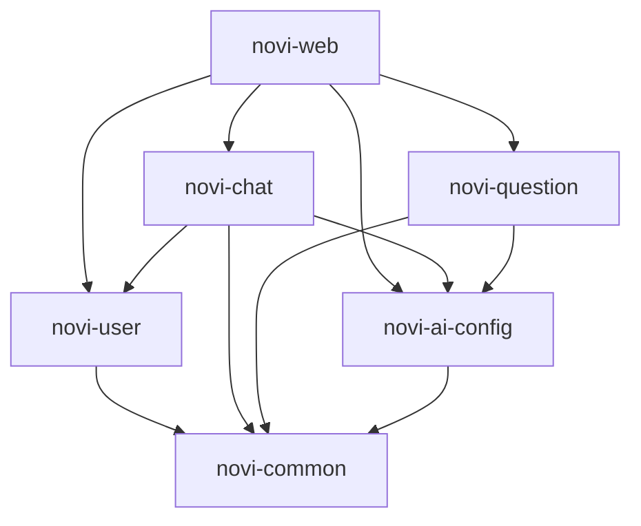

# Novi 项目结构说明文档

## 📂 项目根目录结构

```
Novi/
├── .env                        # 环境变量配置
├── .git/                       # Git版本控制
├── .gitignore                  # Git忽略规则
├── .idea/                      # IntelliJ IDEA配置
├── .mvn/                       # Maven Wrapper配置
├── docs/                       # 项目文档目录
│   ├── 01-入门指南/
│   ├── 02-架构设计/
│   ├── 03-功能模块/
│   ├── 04-API文档/
│   └── 05-其他/
├── logs/                       # 日志文件目录
├── novi-ai-config/             # [模块] AI模型配置模块
├── novi-chat/                  # [模块] AI聊天模块
├── novi-common/                # [模块] 公共模块
├── novi-question/              # [模块] AI出题模块
├── novi-user/                  # [模块] 用户管理模块
├── novi-web/                   # [模块] Web启动与API聚合模块
├── pom.xml                     # 父工程 Maven 配置
├── README.md                   # 项目说明文档
└── sql/                        # 数据库初始化脚本
```

## 🧩 模块划分与职责

本项目采用 Maven 多模块架构，各模块职责如下：

### 1. novi-common (公共模块)
- **职责**：存放公共工具类、通用配置、全局异常处理、通用枚举和常量。
- **依赖**：被所有其他业务模块依赖。
- **主要内容**：
  - `Result<T>`: 统一响应结果封装
  - `GlobalExceptionHandler`: 全局异常处理器
  - `JwtUtil`: JWT 工具类
  - `BaseEntity`: 实体基类

### 2. novi-user (用户管理模块)
- **职责**：处理用户注册、登录、个人信息管理、偏好设置等。
- **主要功能**：
  - 用户账号管理 (UserAccount)
  - 用户偏好设置 (UserPreference)
  - 登录认证与权限校验

### 3. novi-ai-config (AI配置模块)
- **职责**：管理AI模型配置、Prompt配置，提供动态模型切换能力。
- **主要功能**：
  - AI模型配置管理 (AiModelConfig)
  - 动态 ChatClient 工厂 (DynamicChatModelFactory)
  - Prompt 模板管理

### 4. novi-chat (AI聊天模块)
- **职责**：处理用户与AI的对话交互、会话管理、聊天记录存储。
- **主要功能**：
  - 聊天会话管理 (ChatSession)
  - 消息记录存储 (ChatMessage)
  - 聊天上下文维护 (ChatMemory)

### 5. novi-question (AI出题模块)
- **职责**：利用AI能力生成题目，管理出题记录。
- **主要功能**：
  - 题目生成请求处理
  - 题目生成记录 (QuestionGenerationRecord)
  - 题目示例管理 (QuestionExample)

### 6. novi-web (Web聚合模块)
- **职责**：项目的启动入口，聚合所有业务模块，提供统一的 REST API。
- **主要内容**：
  - `NoviApplication`: Spring Boot 启动类
  - `Controller` 层：对外暴露的 API 接口
  - `application.yml`: 统一配置文件

## 🔄 模块依赖关系



## 🗂️ 典型代码结构 (以 novi-user 为例)

```
novi-user/
├── src/main/java/com/n1etzsch3/novi/user/
│   ├── controller/         # (可选) 模块内部控制器
│   ├── mapper/             # MyBatis Mapper 接口
│   ├── pojo/               # 实体类与DTO
│   │   ├── dto/            # 数据传输对象
│   │   └── entity/         # 数据库实体
│   ├── service/            # 服务接口
│   │   └── impl/           # 服务实现
│   └── UserModuleConfig.java # 模块Spring配置
└── src/main/resources/
    └── mapper/             # Mapper XML 文件
```

## 📋 各层职责说明 (通用)

### 1. Controller 层 (位于 novi-web)
- **职责**：处理HTTP请求，参数校验，调用 Service。
- **规范**：
  - 统一返回 `Result<T>`
  - 尽量不包含复杂业务逻辑

### 2. Service 层 (位于各业务模块)
- **职责**：核心业务逻辑，事务控制。
- **规范**：
  - 接口与实现分离
  - 抛出业务异常由 GlobalExceptionHandler 捕获

### 3. Mapper 层 (位于各业务模块)
- **职责**：数据库交互。
- **技术**：MyBatis-Plus

### 4. Domain/Pojo 层
- **Entity**: 对应数据库表
- **DTO**: 前端交互数据对象

## 📦 核心技术栈

| 技术 | 版本 | 用途 |
|------|------|------|
| Spring Boot | 3.x | 核心框架 |
| Spring AI | 1.x | AI 能力集成 |
| MyBatis-Plus | 3.5.x | ORM 框架 |
| MySQL | 8.0 | 数据库 |
| JWT | 0.12.x | 身份认证 |
