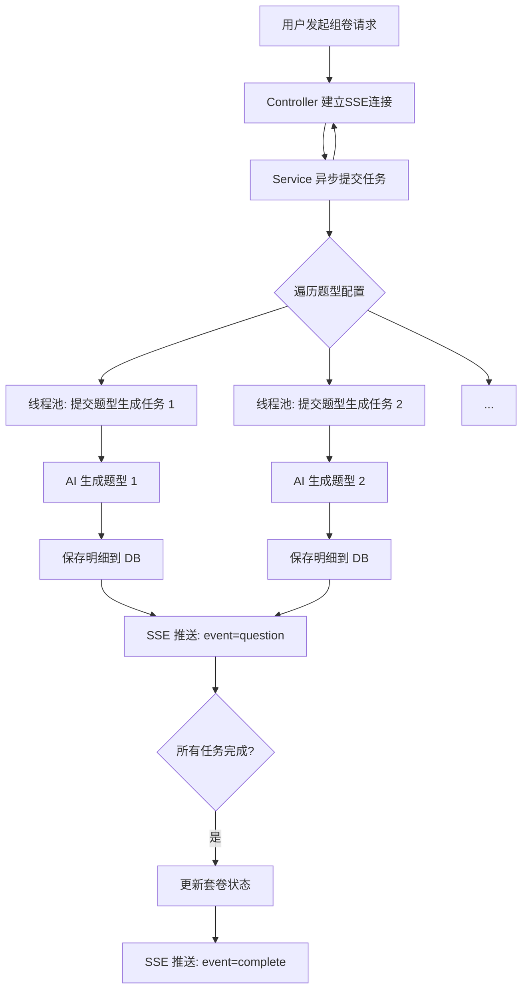

# AI 套卷功能模块文档

## 📋 功能概述

AI 套卷模块是在 "AI 出题" 基础上的进阶功能。它允许一次性生成包含多个题型、涵盖不同知识点的完整试卷。由于生成整套试卷耗时较长，该模块采用 **异步并发** 生成和 **Server-Sent Events (SSE)** 实时推送进度的架构。

## 🎯 核心特性

- **一键组卷**：根据预设的套卷模版（包含多个题型配置），一键生成完整试卷。
- **并发生成**：后台通过线程池并发调用 AI 生成各个题型，大幅缩短总耗时。
- **实时进度 (SSE)**：前端实时接收每个题型的生成结果，即生成即渲染，无需等待全部完成。
- **深度思考集成**：支持启用深度思考模式，生成高质量的综合试卷。
- **结构化存储**：套卷记录 (`paper_generation_record`) 与 题目明细 (`paper_question_detail`) 分离存储，结构清晰。

## 🔌 API 接口

### 生成套卷 (流式)

**接口路径**：`POST /api/v1/papers/generate`

**请求参数**：
```json
{
  "subjectId": 1,
  "paperName": "2024年模拟卷一",
  "enableThinking": true
  // 可选：自定义 paperConfig
}
```

**响应格式**：`text/event-stream`

## 📊 业务流程



## 🧩 核心组件

### Controller 层

**文件**：`PaperGenerationController.java`

- 负责接收组卷请求，设置 SSE 超时时间（普通模式 5min，深度思考 30min）。
- 维护 SSE Emitter 的生命周期，处理超时和错误回调。

### Service 层

**文件**：`PaperGenerationService.java`

- **任务拆分**：根据套卷模版，将整卷拆分为 N 个子任务（每个题型为一个任务）。
- **并发执行**：使用 `CompletableFuture` 和自定义线程池并发执行子任务。
- **结果聚合**：虽然是流式推送，但在后台会最终聚合所有结果并更新主记录状态。

## 💾 数据模型

### 1. PaperGenerationRecord (套卷主表)

存储套卷的基础信息。

```java
@TableName("paper_generation_record")
public class PaperGenerationRecord {
    private Long id;
    private Long userId;
    private Long subjectId;
    private String paperName;
    private Integer totalQuestions;
    private Boolean enableThinking;
    // ...
}
```

### 2. PaperQuestionDetail (套卷明细表)

存储套卷中每个题型的具体内容。

```java
@TableName("paper_question_detail")
public class PaperQuestionDetail {
    private Long id;
    private Long paperId;        // 关联主表
    private String questionType; // 题型编码
    private String generatedQuestions; // 该题型的题目JSON
    private Integer displayOrder; // 显示顺序
    // ...
}
```

## ⚠️ 关键技术点

1.  **超时控制**：由于深度思考模型（如 Gemini 2.0 Flash Thinking）生成速度较慢，且套卷包含多个题型，必须显著增加 HTTP 和 SSE 的超时时间设置。
2.  **并发策略**：通过 `ExecutorService` 或 `CompletableFuture` 并发请求 AI，避免串行执行导致的总耗时过长。
3.  **部分失败处理**：如果某个题型生成失败，SSE 会推送 `error` 事件，但不应中断整个套卷的生成（除非关键错误），前端应能处理部分题型缺失的情况。

## 📚 相关文档

- [AI出题功能模块](AI出题功能模块.md)
- [API 接口文档 - 套卷生成](../04-API文档/接口文档/1.9-套卷生成.md)
