# AI 提示词管理模块文档

## 📋 功能概述

AI 提示词管理模块提供动态管理 AI 系统提示词、性格和语气风格的能力，支持灵活配置 AI 的行为和响应风格。

## 🎯 核心特性

- **多类型配置**：支持系统提示词、性格、语气风格三种配置类型
- **动态管理**：支持运行时增删改配置
- **灵活组合**：用户可自由选择性格和语气风格
- **类型分类**：通过类型字段区分不同配置用途

## 📊 配置类型

### 配置类型枚举

| 类型值 | 类型名称 | 说明 |
|-------|---------|------|
| 0 | 系统提示词 | AI 的基础角色设定和行为规范 |
| 1 | 性格 | AI 的性格特征（如温柔、毒舌、幽默等） |
| 2 | 语气风格 | AI 的说话风格（如正式、轻松、文艺等） |

## 🔌 API 接口

### 1. 添加新配置

**接口路径**：`POST /api/prompt/config`

**请求参数**：
```json
{
  "configKey": "gentle",
  "configValue": "你说话温柔体贴，善于倾听和理解他人的感受。",
  "type": 1,
  "description": "温柔性格"
}
```

**响应格式**：
```json
{
  "code": 200,
  "message": "success",
  "data": null
}
```

### 2. 删除配置

**接口路径**：`DELETE /api/prompt/config/{key}`

**路径参数**：
- `key`：配置的唯一标识

**响应格式**：
```json
{
  "code": 200,
  "message": "success"
}
```

### 3. 根据类型列出配置

**接口路径**：`GET /api/prompt/config/type/{type}`

**路径参数**：
- `type`：配置类型（0/1/2）

**响应格式**：
```json
{
  "code": 200,
  "message": "success",
  "data": [
    {
      "id": 1,
      "configKey": "gentle",
      "configValue": "你说话温柔体贴...",
      "type": 1,
      "description": "温柔性格",
      "createTime": "2025-11-29T10:00:00"
    }
  ]
}
```

## 🧩 核心组件

### Controller 层

**文件**：[AiPromptConfigController.java](file:///c:/Study/Novi/src/main/java/com/n1etzsch3/novi/controller/AiPromptConfigController.java)

**主要方法**：
- `addConfig()` - 添加新配置
- `removeConfig()` - 删除配置
- `listConfigsByType()` - 按类型列出配置

### Service 层

**文件**：`AiPromptConfigService.java`

**主要职责**：
- 配置的增删查操作
- 按类型查询配置
- 提示词组装

## 💾 数据模型

### AiPromptConfig

```java
@TableName("ai_prompt_config")
public class AiPromptConfig {
    private Long id;
    private String configKey;     // 配置唯一标识
    private String configValue;   // 配置内容
    private Integer type;         // 类型：0系统/1性格/2语气
    private String description;   // 描述
    private LocalDateTime createTime;
}
```

### 数据库表结构

**表名**：`ai_prompt_config`

| 字段名 | 类型 | 说明 |
|--------|------|------|
| `id` | BIGINT | 主键ID |
| `config_key` | VARCHAR(50) | 配置唯一标识 |
| `config_value` | TEXT | 配置内容 |
| `type` | TINYINT | 类型（0/1/2） |
| `description` | VARCHAR(255) | 描述 |
| `create_time` | DATETIME | 创建时间 |

## 🎨 配置示例

### 系统提示词示例

```json
{
  "configKey": "base_system",
  "configValue": "你是 Novi，一个温暖、善解人意的 AI 伴侣。你的目标是成为用户的挚友，倾听、理解并陪伴他们。",
  "type": 0,
  "description": "基础系统提示词"
}
```

### 性格配置示例

```json
{
  "configKey": "humorous",
  "configValue": "你幽默风趣，善于用轻松的玩笑缓解气氛，但不失分寸。",
  "type": 1,
  "description": "幽默性格"
}
```

### 语气风格示例

```json
{
  "configKey": "casual",
  "configValue": "说话轻松随和，使用口语化表达，偶尔使用表情符号。",
  "type": 2,
  "description": "轻松随和"
}
```

## 🔄 提示词组装流程

```mermaid
graph TD
    A[用户发送消息] --> B[获取用户偏好设置]
    B --> C[加载基础系统提示词]
    C --> D[加载用户选择的性格]
    D --> E[加载用户选择的语气风格]
    E --> F[组装完整系统提示词]
    F --> G[添加上下文信息]
    G --> H[发送给AI模型]
```



## 📝 使用示例

### 前端选择性格和语气

```javascript
// 获取所有性格选项
async function getPersonalities() {
  const response = await fetch('/api/prompt/config/type/1');
  const data = await response.json();
  return data.data;
}

// 获取所有语气风格
async function getToneStyles() {
  const response = await fetch('/api/prompt/config/type/2');
  const data = await response.json();
  return data.data;
}

// 用户偏好设置保存
async function saveUserPreference(personality, toneStyle) {
  await fetch('/api/v1/preferences', {
    method: 'POST',
    headers: { 'Content-Type': 'application/json' },
    body: JSON.stringify({
      personalityKey: personality,
      toneStyleKey: toneStyle
    })
  });
}
```

### 管理员添加新性格

```javascript
async function addPersonality() {
  await fetch('/api/prompt/config', {
    method: 'POST',
    headers: { 'Content-Type': 'application/json' },
    body: JSON.stringify({
      configKey: 'tsundere',
      configValue: '你是个傲娇的性格，嘴上说着不关心，但行动上却很关心对方。',
      type: 1,
      description: '傲娇性格'
    })
  });
}
```

## 🎭 预设配置建议

### 性格类型

- **温柔体贴**：善解人意，语言温和
- **活泼开朗**：热情积极，充满活力
- **沉稳理性**：逻辑清晰，冷静客观
- **幽默风趣**：轻松诙谐，善于调侃
- **毒舌直率**：直言不讳，一针见血

### 语气风格

- **正式严谨**：用词准确，逻辑严密
- **轻松随和**：口语化，亲切自然
- **文艺浪漫**：优美抒情，富有诗意
- **简洁明了**：言简意赅，直击重点

## 📚 相关文档

- [AI聊天功能模块](file:///C:/Users/35666/.gemini/antigravity/brain/774ebe23-99e1-46d9-a3e1-52263e77b58e/AI聊天功能模块.md)
- [用户管理模块](file:///C:/Users/35666/.gemini/antigravity/brain/774ebe23-99e1-46d9-a3e1-52263e77b58e/用户管理模块.md)
