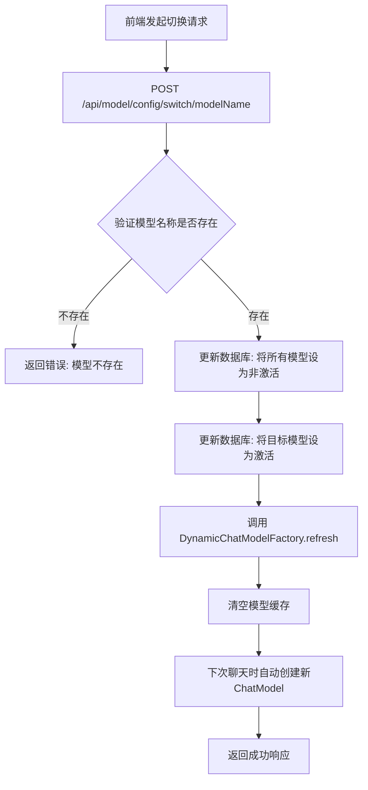

# AI 模型配置模块文档

## 📋 功能概述

AI 模型配置模块 (`novi-ai-config`) 提供了灵活的 AI 模型管理能力，支持多个模型配置、动态切换（热切换），无需重启应用即可更换 AI 模型。

## 🎯 核心特性

- **多模型支持**：可配置多个不同的 AI 模型
- **热切换**：运行时动态切换模型，无需重启
- **配置管理**：支持模型的增删改查
- **激活状态管理**：同一时间只有一个模型处于激活状态
- **兼容多种API**：支持 OpenAI 协议的各种模型（讯飞星火、通义千问、豆包等）

## 🔌 API 接口

> [!IMPORTANT]
> 为了安全考虑，所有对外API接口仅返回安全的DTO数据，**不包含API Key等敏感信息**。前端只能查看模型列表和执行模型切换操作，无法进行模型的增删改操作。

### 1. 获取所有模型配置（安全版本）

**接口路径**：`GET /api/model/config/list`

**响应格式**：
```json
{
  "code": 200,
  "message": "success",
  "data": [
    {
      "id": 1,
      "modelName": "doubao-seed-1-6-flash-250828",
      "description": "豆包模型 - 快速响应版本",
      "isActive": true
    },
    {
      "id": 2,
      "modelName": "gpt-3.5-turbo",
      "description": "OpenAI GPT-3.5 Turbo",
      "isActive": false
    }
  ]
}
```

> [!NOTE]
> 返回的数据中**不包含** `baseUrl`、`apiKey`、`completionsPath` 等敏感配置信息。

### 2. 获取当前激活模型（安全版本）

**接口路径**：`GET /api/model/config/active`

**响应格式**：
```json
{
  "code": 200,
  "message": "success",
  "data": {
    "id": 1,
    "modelName": "doubao-seed-1-6-flash-250828",
    "description": "豆包模型 - 快速响应版本",
    "isActive": true
  }
}
```

**错误响应**（无激活模型时）：
```json
{
  "code": 500,
  "message": "error",
  "data": "当前没有激活的模型"
}
```

### 3. 切换模型

**接口路径**：`POST /api/model/config/switch/{modelName}`

**路径参数**：
- `modelName`：要激活的模型名称（例如：`doubao-seed-1-6-flash-250828`）

**响应格式**：
```json
{
  "code": 200,
  "message": "success",
  "data": "模型切换成功"
}
```

**错误响应**：
```json
{
  "code": 500,
  "message": "error",
  "data": "模型切换失败，模型不存在"
}
```

> [!WARNING]
> **模型的增删改操作已移除**
> 
> 为了保证系统安全性和稳定性，AI模型的增删改操作不再通过REST API暴露给前端。
> 模型配置应由**系统管理员直接在数据库中管理**。
> 
> 前端用户只能：
> - ✅ 查看所有可用模型列表
> - ✅ 查看当前激活的模型
> - ✅ 切换到不同的模型

### 4. ~~添加新模型~~（已移除）

**此接口已移除**，模型需在数据库中直接添加：

```sql
INSERT INTO ai_model_config 
  (model_name, base_url, api_key, completions_path, is_active, description)
VALUES 
  ('gpt-3.5-turbo', 'https://api.openai.com/v1', 'sk-xxx', '/chat/completions', 0, 'OpenAI GPT-3.5 Turbo');
```

### 5. ~~更新模型配置~~（已移除）

**此接口已移除**，模型配置需在数据库中直接更新。

### 6. ~~删除模型~~（已移除）

**路径参数**：
- `modelId`：要删除的模型 ID

**注意**：无法删除当前激活的模型

## 📊 业务流程

### 模型切换流程



### 工作原理说明

1. **前端请求**: 用户在前端选择模型，通过模型名称发起切换请求
2. **数据库更新**: Service层在数据库中更新激活状态
3. **缓存刷新**: Controller层调用Factory的`refresh()`方法清空缓存
4. **懒加载**: 下次聊天请求时，Factory自动从数据库读取新的激活模型并创建ChatModel实例


## 🧩 核心组件

### Controller 层

**文件**：`AiModelConfigController.java` (位于 `novi-web` 模块)

**主要方法**：
- `listAllModels()` - 列出所有模型（仅返回安全DTO）
- `getActiveModel()` - 获取当前激活模型（仅返回安全DTO）
- `switchModel(String modelName)` - 根据模型名称切换模型

### Service 层

**接口**：`AiModelConfigService.java` (位于 `novi-ai-config` 模块)

**实现**：`AiModelConfigServiceImpl.java`

**主要方法**：
- `getActiveModel()` - 获取当前激活模型（完整配置，内部使用）
- `getActiveModelDTO()` - 获取当前激活模型（安全DTO，对外API）
- `listAllModelsDTO()` - 列出所有模型（安全DTO列表）
- `switchModelByName(String modelName)` - 根据模型名称切换模型

> [!IMPORTANT]
> `getActiveModel()` 返回完整的模型配置（包含API Key），**仅供内部组件使用**，不应暴露给外部API。
> 对外API应使用 `getActiveModelDTO()` 和 `listAllModelsDTO()` 方法。

### Factory 层

**文件**：`DynamicChatModelFactory.java` (位于 `novi-ai-config` 模块)

**主要职责**：
- 动态创建 `ChatClient` 实例
- 缓存当前激活的 `ChatClient`
- 提供 `refresh()` 方法重新加载配置

**关键方法**：
```java
public ChatClient getChatClient() {
    // 返回当前激活的 ChatClient
}

public void refresh() {
    // 重新加载配置，创建新的 ChatClient
}
```

## 💾 数据模型

### AiModelConfig（模型配置）

```java
@TableName("ai_model_config")
public class AiModelConfig {
    private Long id;                    // 主键ID
    private String modelName;           // 模型名称
    private String baseUrl;             // API基础URL
    private String apiKey;              // API密钥
    private String completionsPath;     // 完成接口路径
    private Integer isActive;           // 是否激活（0:否，1:是）
    private String description;         // 模型描述
    private LocalDateTime createTime;
    private LocalDateTime updateTime;
}
```

### 数据库表结构

**表名**：`ai_model_config`

| 字段名 | 类型 | 说明 |
|--------|------|------|
| `id` | BIGINT | 主键ID（自增） |
| `model_name` | VARCHAR(100) | 模型名称（唯一） |
| `base_url` | VARCHAR(255) | API基础URL |
| `api_key` | VARCHAR(255) | API密钥 |
| `completions_path` | VARCHAR(100) | 完成接口路径 |
| `is_active` | TINYINT(1) | 是否激活（0/1） |
| `description` | VARCHAR(255) | 模型描述 |
| `create_time` | DATETIME | 创建时间 |
| `update_time` | DATETIME | 更新时间 |

## 🔄 热切换机制

### 实现原理

1. **配置存储**：所有模型配置存储在数据库中
2. **工厂模式**：使用 `DynamicChatModelFactory` 创建 `ChatClient`
3. **缓存刷新**：切换模型时调用 `refresh()` 方法
4. **无缝切换**：新请求自动使用新模型，旧请求继续使用旧模型

### 关键代码示例

```java
@Service
public class DynamicChatModelFactory {
    
    private ChatClient cachedChatClient;
    
    public ChatClient getChatClient() {
        if (cachedChatClient == null) {
            refresh();
        }
        return cachedChatClient;
    }
    
    public void refresh() {
        // 从数据库加载激活的模型配置
        AiModelConfig activeModel = aiModelConfigService.getActiveModel();
        
        // 创建新的 ChatClient
        this.cachedChatClient = createChatClient(activeModel);
    }
}
```

## 📝 使用示例

### 管理员操作流程

1. **查看所有模型**
   ```bash
   GET /api/model/config/list
   ```

2. **添加新模型**
   ```bash
   POST /api/model/config
   {
     "modelName": "qwen-turbo",
     "baseUrl": "https://dashscope.aliyuncs.com/api/v1",
     "apiKey": "your-api-key",
     "completionsPath": "/services/aigc/text-generation/generation",
     "description": "通义千问 Turbo"
   }
   ```

3. **切换到新模型**
   ```bash
   POST /api/model/config/switch/2
   ```

4. **验证切换**
   ```bash
   GET /api/model/config/active
   ```


### 前端集成示例

```javascript
// 获取所有模型
async function listModels() {
  const response = await fetch('/api/model/config/list', {
    headers: { 'Authorization': 'Bearer ' + token }
  });
  const data = await response.json();
  return data.data; // 返回安全的DTO数组
}

// 切换模型（使用模型名称）
async function switchModel(modelName) {
  const response = await fetch(`/api/model/config/switch/${modelName}`, {
    method: 'POST',
    headers: { 'Authorization': 'Bearer ' + token }
  });
  const data = await response.json();
  if (data.code === 200) {
    console.log('模型切换成功！');
    return true;
  } else {
    console.error('模型切换失败：', data.data);
    return false;
  }
}

// 获取当前激活的模型
async function getActiveModel() {
  const response = await fetch('/api/model/config/active', {
    headers: { 'Authorization': 'Bearer ' + token }
  });
  const data = await response.json();
  return data.data; // 返回安全的DTO对象
}
```


## 🔐 安全考虑

1. **API Key 保护**：
   - API Key 存储在数据库中
   - 不在日志中输出 API Key
   - 前端不暴露完整 API Key

2. **权限控制**：
   - 只有管理员可以管理模型配置
   - 普通用户只能查看和使用

3. **环境变量替换**：
   - 支持使用 `${AI_API_KEY}` 从环境变量读取

## 🎨 支持的模型

| 模型提供商 | 模型名称 | 兼容性 |
|-----------|---------|--------|
| 豆包 | doubao-seed-1-6-flash-250828 | ✅ 已测试 |
| OpenAI | gpt-3.5-turbo, gpt-4 | ✅ 兼容 |
| 通义千问 | qwen-turbo, qwen-plus | ✅ 兼容 |
| 讯飞星火 | spark-v3.5 | ✅ 兼容 |

## 📚 相关文档

- [AI聊天功能模块](file:///Users/n1etzsch3/Documents/Novi/docs/03-功能模块/AI聊天功能模块.md)
- [AI提示词管理模块](file:///Users/n1etzsch3/Documents/Novi/docs/03-功能模块/AI提示词管理模块.md)
