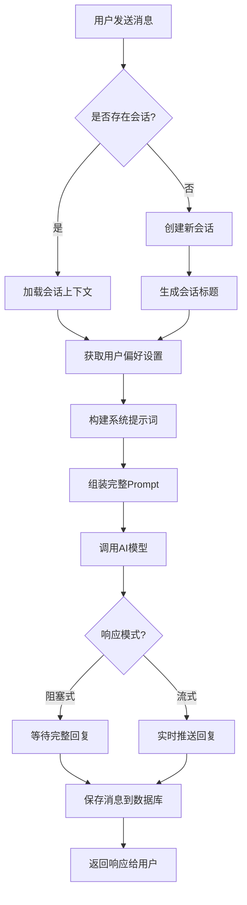

# AI 聊天功能模块文档

## 📋 功能概述

AI 聊天模块是 Novi 项目的核心功能，提供智能对话能力。支持阻塞式和流式两种响应模式，具备上下文记忆和会话管理功能。

## 🎯 核心特性

- **双响应模式**：阻塞式（一次性返回）和流式（SSE实时推送）
- **上下文记忆**：基于数据库的持久化聊天记忆
- **会话管理**：自动创建会话、生成标题
- **多轮对话**：AI 能记住之前的对话内容
- **个性化配置**：支持动态调整 AI 性格和语气

## 🔌 API 接口

### 1. 发送消息（阻塞式）

**接口路径**：`POST /api/v1/chat/send/call`

**请求参数**：
```json
{
  "sessionId": "会话ID（可选，新会话传null）",
  "message": "用户消息内容"
}
```

**响应格式**：
```json
{
  "code": 200,
  "message": "success",
  "data": {
    "sessionId": "会话ID",
    "content": "AI回复内容",
    "timestamp": 1732851234000
  }
}
```

### 2. 发送消息（流式）

**接口路径**：`POST /api/v1/chat/send/stream`

**请求参数**：同上

**响应格式**：Server-Sent Events (SSE)
```
data: {"type":"content","data":"你"}
data: {"type":"content","data":"好"}
data: {"type":"content","data":"！"}
data: {"type":"done","sessionId":"session-123"}
```

## 📊 业务流程

### 聊天处理流程



## 🧩 核心组件

### Controller 层

**文件**：[ChatController.java](file:///c:/Study/Novi/src/main/java/com/n1etzsch3/novi/controller/ChatController.java)

**主要方法**：
- `sendMessage()` - 处理阻塞式聊天请求
- `sendMessageStream()` - 处理流式聊天请求

### Service 层

**文件**：`ChatService.java` 及其实现

**主要职责**：
- 会话管理（创建、识别、更新）
- 提示词构建（系统提示词 + 用户偏好）
- AI 模型调用
- 消息持久化

**关键方法**：
- `handleCallMessage()` - 处理阻塞式消息
- `handleStreamMessage()` - 处理流式消息
- `buildSystemPrompt()` - 构建系统提示词

### Repository 层

**自定义聊天记忆**：`NoviDatabaseChatMemory`

**功能**：
- 实现 Spring AI 的 `ChatMemory` 接口
- 将对话历史存储到 MySQL
- 支持多轮对话上下文

## 💾 数据模型

### ChatSession（会话）

```java
@TableName("chat_session")
public class ChatSession {
    private Long id;              // 会话ID
    private Long userId;          // 用户ID
    private String sessionTitle;  // 会话标题
    private LocalDateTime createdAt;
    private LocalDateTime lastActiveTime;
    // ...
}
```

### ChatMessage（消息）

```java
@TableName("chat_message")
public class ChatMessage {
    private Long id;
    private String sessionId;  // 会话ID
    private Long userId;       // 用户ID
    private String role;       // user/assistant
    private String content;    // 消息内容
    private LocalDateTime timestamp;
    // ...
}
```

### DTO 对象

**ChatRequest**：聊天请求
```java
public class ChatRequest {
    private String sessionId;
    private String message;
}
```

**ChatResponse**：聊天响应
```java
public class ChatResponse {
    private String sessionId;
    private String content;
    private Long timestamp;
}
```

## 🔄 上下文记忆机制

### 短期记忆（Window Memory）

- 基于 `chat_message` 表
- 自动加载最近 N 条对话
- 支持滑动窗口

### 长期记忆（计划中）

- 基于 `user_memory` 表
- 提取关键事实信息
- 向量数据库检索

## 🎨 提示词构建

### 系统提示词结构

```
[系统角色设定] + [性格描述] + [语气风格] + [上下文信息]
```

**示例**：
```
你是 Novi，一个温暖、善解人意的 AI 伴侣。
性格：温柔体贴
语气：轻松随和
当前时间：2025-11-29 13:24
记住用户之前告诉你的信息...
```

## 📝 使用示例

### 前端调用示例（阻塞式）

```javascript
fetch('/api/v1/chat/send/call', {
  method: 'POST',
  headers: {
    'Content-Type': 'application/json',
    'Authorization': 'Bearer ' + token
  },
  body: JSON.stringify({
    sessionId: sessionId || null,
    message: '你好，Novi！'
  })
})
.then(res => res.json())
.then(data => {
  console.log('AI回复:', data.data.content);
});
```

### 前端调用示例（流式）

```javascript
const eventSource = new EventSource('/api/v1/chat/send/stream');

eventSource.onmessage = (event) => {
  const data = JSON.parse(event.data);
  
  if (data.type === 'content') {
    // 追加AI回复内容
    appendMessage(data.data);
  } else if (data.type === 'done') {
    // 会话结束
    eventSource.close();
  }
};
```

## ⚙️ 配置说明

### AI 模型配置

通过 `ai_model_config` 表动态配置：
- 模型名称
- API 基础 URL
- API Key
- 完成接口路径

### 提示词配置

通过 `ai_prompt_config` 表配置：
- 系统提示词模板
- AI 性格选项
- 语气风格选项

## 🔍 关键技术点

1. **响应式编程**：使用 Reactor `Flux` 实现流式响应
2. **SSE 传输**：`MediaType.TEXT_EVENT_STREAM_VALUE`
3. **JWT 认证**：通过拦截器提取 `userId`
4. **ThreadLocal 传递**：跨层传递用户上下文
5. **Spring AI 集成**：使用 `ChatClient` 和 `ChatMemory`

## 📚 相关文档

- [会话管理模块](file:///C:/Users/35666/.gemini/antigravity/brain/774ebe23-99e1-46d9-a3e1-52263e77b58e/会话管理模块.md)
- [AI提示词管理模块](file:///C:/Users/35666/.gemini/antigravity/brain/774ebe23-99e1-46d9-a3e1-52263e77b58e/AI提示词管理模块.md)
- [AI模型配置模块](file:///C:/Users/35666/.gemini/antigravity/brain/774ebe23-99e1-46d9-a3e1-52263e77b58e/AI模型配置模块.md)
