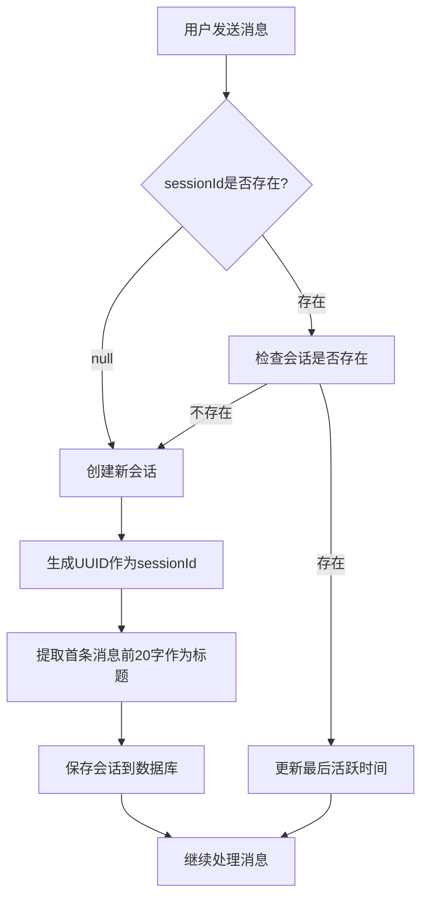

# 会话管理模块文档

## 📋 功能概述

会话管理模块负责管理用户的聊天会话，提供会话的创建、查询、删除等功能，支持自动会话识别和标题生成。

## 🎯 核心特性

- **自动会话管理**：新对话自动创建会话
- **智能标题生成**：根据首条消息自动生成会话标题
- **会话列表**：按最后活跃时间排序
- **历史回溯**：加载完整会话历史
- **软删除**：逻辑删除，保障数据安全

## 🔌 API 接口

### 1. 获取用户会话列表

**接口路径**：`GET /api/v1/sessions`

**响应格式**：
```json
{
  "code": 200,
  "message": "success",
  "data": [
    {
      "id": 1,
      "sessionId": "session-uuid-123",
      "sessionTitle": "今天天气真不错，我们...",
      "createdAt": "2025-11-29T10:00:00",
      "lastActiveTime": "2025-11-29T12:30:00",
      "messageCount": 15
    }
  ]
}
```

### 2. 获取会话历史消息

**接口路径**：`GET /api/v1/sessions/{sessionId}/messages`

**路径参数**：
- `sessionId`：会话ID

**响应格式**：
```json
{
  "code": 200,
  "message": "success",
  "data": [
    {
      "id": 1,
      "role": "user",
      "content": "你好，Novi！",
      "timestamp": "2025-11-29T10:00:00"
    },
    {
      "id": 2,
      "role": "assistant",
      "content": "你好！很高兴见到你～",
      "timestamp": "2025-11-29T10:00:05"
    }
  ]
}
```

### 3. 删除会话

**接口路径**：`DELETE /api/v1/sessions/{sessionId}`

**路径参数**：
- `sessionId`：会话ID

**响应格式**：
```json
{
  "code": 200,
  "message": "success"
}
```

## 📊 业务流程

### 会话自动管理流程



## 🧩 核心组件

### Controller 层

**文件**：`ChatSessionController.java`

**主要方法**：
- `getUserSessions()` - 获取用户会话列表
- `getSessionMessages()` - 获取会话消息历史
- `deleteSession()` - 删除会话

### Service 层

**文件**：`ChatSessionService.java`

**主要职责**：
- 会话创建与识别
- 会话标题生成
- 会话列表查询
- 会话软删除

**关键方法**：
```java
// 创建新会话
ChatSession createSession(Long userId, String firstMessage);

// 更新会话活跃时间
void updateLastActiveTime(String sessionId);

// 获取用户所有会话
List<ChatSession> getUserSessions(Long userId);

// 删除会话
void deleteSession(String sessionId, Long userId);
```

## 💾 数据模型

### ChatSession（会话）

```java
@TableName("chat_session")
public class ChatSession {
    private Long id;
    private String sessionId;        // UUID
    private Long userId;             // 所属用户
    private String sessionTitle;     // 会话标题
    private LocalDateTime createdAt;
    private LocalDateTime lastActiveTime;
    private Integer isDeleted;       // 软删除标记
}
```

### 数据库表结构

**表名**：`chat_session`

| 字段名 | 类型 | 说明 |
|--------|------|------|
| `id` | BIGINT | 主键ID |
| `session_id` | VARCHAR(100) | 会话UUID（唯一） |
| `user_id` | BIGINT | 用户ID |
| `session_title` | VARCHAR(200) | 会话标题 |
| `created_at` | DATETIME | 创建时间 |
| `last_active_time` | DATETIME | 最后活跃时间 |
| `is_deleted` | TINYINT | 是否删除（0/1） |

## 🔄 会话标题生成

### 生成规则

1. **首条消息截取**：取用户第一条消息的前20个字符
2. **省略号补充**：超过20字符自动添加"..."
3. **去除换行**：替换换行符为空格
4. **特殊处理**：空消息使用默认标题"新对话"

### 代码示例

```java
public String generateTitle(String firstMessage) {
    if (firstMessage == null || firstMessage.trim().isEmpty()) {
        return "新对话";
    }
    
    String cleanMessage = firstMessage.replaceAll("\\n", " ");
    
    if (cleanMessage.length() > 20) {
        return cleanMessage.substring(0, 20) + "...";
    }
    
    return cleanMessage;
}
```

## 📝 使用示例

### 前端会话列表实现

```javascript
// 加载会话列表
async function loadSessions() {
  const response = await fetch('/api/v1/sessions', {
    headers: { 'Authorization': 'Bearer ' + token }
  });
  const data = await response.json();
  
  // 按最后活跃时间排序（后端已排序）
  const sessions = data.data;
  
  sessions.forEach(session => {
    renderSessionItem(session);
  });
}

// 渲染会话项
function renderSessionItem(session) {
  const div = document.createElement('div');
  div.className = 'session-item';
  div.innerHTML = `
    <div class="session-title">${session.sessionTitle}</div>
    <div class="session-time">${formatTime(session.lastActiveTime)}</div>
  `;
  div.onclick = () => loadSessionMessages(session.sessionId);
  sessionList.appendChild(div);
}

// 加载会话消息
async function loadSessionMessages(sessionId) {
  const response = await fetch(`/api/v1/sessions/${sessionId}/messages`, {
    headers: { 'Authorization': 'Bearer ' + token }
  });
  const data = await response.json();
  
  data.data.forEach(msg => {
    renderMessage(msg.role, msg.content);
  });
}

// 删除会话
async function deleteSession(sessionId) {
  if (!confirm('确定删除此会话？')) return;
  
  await fetch(`/api/v1/sessions/${sessionId}`, {
    method: 'DELETE',
    headers: { 'Authorization': 'Bearer ' + token }
  });
  
  // 刷新列表
  loadSessions();
}
```

## 🎨 前端UI建议

### 会话列表布局

```
┌─────────────────────────┐
│ 今天天气真不错，我们...    │ 12:30
│ 如何学习Spring Boot...  │ 昨天
│ 推荐几本好书             │ 2天前
│ 周末去哪里玩比较好...     │ 1周前
└─────────────────────────┘
```

### 交互设计

- **点击会话**：加载历史消息
- **长按会话**：显示删除、重命名等选项
- **下拉刷新**：重新加载会话列表
- **置顶功能**：常用会话置顶显示

## 🔐 权限控制

1. **用户隔离**：只能查看和操作自己的会话
2. **身份验证**：通过JWT验证用户身份
3. **数据安全**：软删除保障数据可恢复

## 📚 相关文档

- [AI聊天功能模块](file:///C:/Users/35666/.gemini/antigravity/brain/774ebe23-99e1-46d9-a3e1-52263e77b58e/AI聊天功能模块.md)
- [用户管理模块](file:///C:/Users/35666/.gemini/antigravity/brain/774ebe23-99e1-46d9-a3e1-52263e77b58e/用户管理模块.md)
